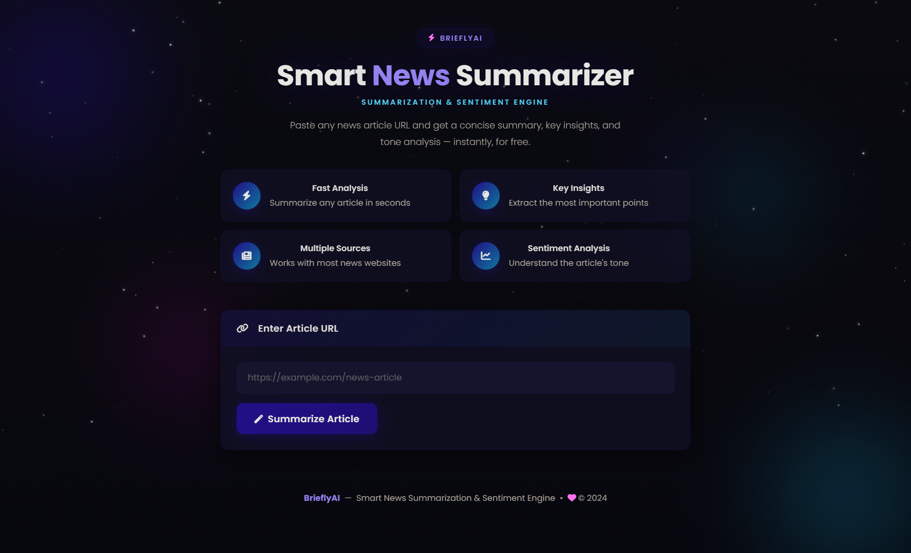

<div align="center">


# ⚡ BrieflyAI
### Smart News Summarization & Sentiment Engine

[](https://python.org)
[](https://flask.palletsprojects.com)
[](https://www.nltk.org)
[](https://render.com)
[](LICENSE)
[]()

**Paste any news article URL. Get a smart summary, key insights, and tone analysis — instantly, for free.**

[🚀 Live Demo](https://brieflyai-smart-news-summarization-and.onrender.com) · [📖 Documentation](#documentation) · [🐛 Report Bug](https://github.com/SamridhiiGupta/BrieflyAI--Smart_News_Summarization_and_Sentiment_Engine/issues)

</div>

---

## 📌 Table of Contents

- [Overview](#-overview)
- [Screenshots](#-screenshots)
- [Features](#-features)
- [How It Works](#-how-it-works)
- [Tech Stack](#-tech-stack)
- [Project Structure](#-project-structure)
- [Installation & Setup](#-installation--setup)
- [Deployment](#-deployment)
- [Environment Variables](#-environment-variables)
- [Future Improvements](#-future-improvements)

---

## 🌟 Overview

**BrieflyAI** is a production-grade web application that transforms any news article URL into a concise, intelligent digest — in seconds.

In today's information-overloaded world, reading full articles is time-consuming. BrieflyAI solves this by:

- **Extracting** the raw article text from any public news URL
- **Summarizing** it into 4 key sentences using TF-IDF based NLP scoring
- **Identifying** the 5 most important bullet points
- **Analysing** the emotional tone using VADER sentiment analysis

> **Zero cost. Zero API keys. No model downloads. Runs entirely offline after setup.**

---

## 📸 Screenshots

### 🏠 Landing Page — Dark Animated Interface


> The homepage features a live canvas starfield, animated glowing orbs, subtle grid lines, and a cursor-reactive glow. Feature cards use 3D tilt physics on hover.

---

### 📊 Results Page — Full Analysis Output


> After summarization, the app displays the article title, source badge, estimated reading time, AI-generated summary, 5 staggered key point bullets, and a live sentiment meter with VADER scores.

---

## ✨ Features

### 🧠 Smart Extractive Summarization
Uses a custom **TF-IDF scoring pipeline** (zero external ML models) that scores every sentence across 5 dimensions — topic relevance, position, length, named entities, and importance indicators — then selects the top sentences in reading order.

### 🔑 Key Points Extraction
Automatically identifies the 5 most significant sentences from the article, prioritising sentences that contain signal words like *announced*, *confirmed*, *warned*, *discovered*.

### 📊 Sentiment Analysis
Powered by **NLTK VADER** — a lexicon-based analyser specifically tuned for news and social text. Returns compound, positive, negative, and neutral scores with an animated visual meter.

### 🧱 Paywall Handling
Implements a two-step fallback strategy:
1. Direct HTTP fetch with a realistic browser User-Agent
2. Automatic fallback to **archive.is** cached copy if a paywall is detected

### 🎨 Premium Animated UI
- Canvas-based starfield with 160 twinkling stars and random shooting stars
- 3D card tilt that tracks mouse position using `perspective()` transforms
- Magnetic primary button that pulls toward the cursor
- Ripple effect on all clickable elements
- Skeleton loader that mirrors the exact layout of the results card
- Staggered key-point bullet animations (90ms offset per item)
- Animated gradient border sweep on input focus
- Cursor proximity glow that follows the mouse

### ⚡ Single-Command Launch
One command starts the server **and** automatically opens the browser — no manual URL needed.

---

## 🔄 How It Works

```
User pastes URL
      │
      ▼
┌─────────────────────────────┐
│  1. FETCH                   │
│  Direct HTTP → Paywall?     │
│  Yes → Try archive.is       │
└────────────┬────────────────┘
             │
             ▼
┌─────────────────────────────┐
│  2. EXTRACT                 │
│  BeautifulSoup strips nav,  │
│  ads, scripts, footers      │
│  Prefers <article> / OG     │
└────────────┬────────────────┘
             │
             ▼
┌─────────────────────────────┐
│  3. SCORE (TF-IDF)          │
│  Every sentence scored:     │
│  • TF-IDF relevance  40%    │
│  • Position weight   25%    │
│  • Length score      15%    │
│  • Importance words  10%    │
│  • Named entities    10%    │
└────────────┬────────────────┘
             │
             ▼
┌─────────────────────────────┐
│  4. SELECT & ORDER          │
│  Top N sentences restored   │
│  to original reading order  │
└────────────┬────────────────┘
             │
             ▼
┌─────────────────────────────┐
│  5. SENTIMENT (VADER)       │
│  Compound / Pos / Neg / Neu │
└────────────┬────────────────┘
             │
             ▼
        JSON Response
        → Frontend renders
          with animations
```

---

## 🛠️ Tech Stack

| Layer | Technology | Purpose |
|---|---|---|
| **Frontend** | HTML5, CSS3, Vanilla JS | UI & interactions |
| **Animations** | Canvas API, CSS Keyframes | Starfield, tilt, ripple, magnetic |
| **UI Framework** | Bootstrap 5 | Responsive layout |
| **Icons** | Font Awesome 6 | UI icons |
| **Backend** | Python 3.11, Flask 3.0 | REST API server |
| **NLP** | NLTK 3.8 | Sentiment (VADER) + tokenisation |
| **Summarization** | Custom TF-IDF (pure Python) | Zero-dependency sentence scoring |
| **HTML Parsing** | BeautifulSoup4 + lxml | Article extraction + noise removal |
| **HTTP Client** | Requests | Article fetching + archive fallback |
| **Production Server** | Gunicorn | WSGI server for deployment |
| **Deployment** | Render (free tier) | Cloud hosting |
| **Version Control** | Git + GitHub | Source control |

---

## 📁 Project Structure

```
BrieflyAI/
│
├── run.py                  # Local dev entry point (auto-opens browser)
├── wsgi.py                 # Production entry point for Gunicorn
├── requirements.txt        # Python dependencies (6 packages only)
├── Procfile                # Render/Heroku process config
├── render.yaml             # Render auto-deploy config
├── .gitignore
│
├── app/                    # Flask application package
│   ├── __init__.py         # App factory (create_app)
│   ├── config.py           # All settings in one place
│   │
│   ├── routes/
│   │   ├── api.py          # POST /api/summarize — validated endpoint
│   │   └── views.py        # GET / — serves the frontend
│   │
│   └── services/
│       ├── fetcher.py      # HTTP fetch + paywall detection + archive fallback
│       ├── extractor.py    # BeautifulSoup text & title extraction
│       └── nlp.py          # TF-IDF summarizer + key points + VADER sentiment
│
├── templates/
│   └── index.html          # Single-page frontend (Jinja2)
│
└── static/
    ├── css/
    │   └── style.css       # Full design system with motion variables
    └── js/
        └── main.js         # Starfield, tilt, magnetic, ripple, all interactions
```

---

## ⚙️ Installation & Setup

### Prerequisites
- Python 3.11+
- Git

### 1. Clone the repository
```bash
git clone https://github.com/SamridhiiGupta/BrieflyAI--Smart_News_Summarization_and_Sentiment_Engine.git
cd BrieflyAI--Smart_News_Summarization_and_Sentiment_Engine
```

### 2. Create and activate a virtual environment
```bash
# Windows
python -m venv venv
venv\Scripts\activate

# macOS / Linux
python3 -m venv venv
source venv/bin/activate
```

### 3. Install dependencies
```bash
pip install -r requirements.txt
```
> NLTK data (~2 MB) downloads automatically on first run.

### 4. Run the app
```bash
python run.py
```
Browser opens automatically at **http://127.0.0.1:5000** 🚀

---

## 🌐 Deployment

BrieflyAI is deployed on **Render** (free tier) with zero configuration needed.

### Deploy your own instance

1. Fork this repository
2. Go to [render.com](https://render.com) → New → Web Service
3. Connect your GitHub repo
4. Set these fields:

| Field | Value |
|---|---|
| **Build Command** | `pip install -r requirements.txt && python -c "import nltk; nltk.download('punkt_tab', quiet=True); nltk.download('vader_lexicon', quiet=True); nltk.download('stopwords', quiet=True)"` |
| **Start Command** | `gunicorn wsgi:app --workers 2 --threads 2 --timeout 120` |
| **Instance Type** | Free |

5. Click **Deploy Web Service** — live in ~3 minutes.

> **Note:** Free tier instances sleep after 15 minutes of inactivity. First visit after sleep takes ~30 seconds to wake up.

---

## 🔐 Environment Variables

| Variable | Default | Description |
|---|---|---|
| `FLASK_DEBUG` | `false` | Set to `true` for local debug mode |
| `SECRET_KEY` | `dev-secret-key` | Change this in production |
| `PYTHON_VERSION` | `3.11.0` | Python runtime for Render |

No paid API keys required. The app is entirely self-contained.

---

## 🔮 Future Improvements

- [ ] **PDF support** — summarise uploaded PDF documents
- [ ] **History** — save and compare previous summaries
- [ ] **Multi-language** — support non-English articles
- [ ] **Topic classification** — auto-tag articles (Politics, Tech, Sports…)
- [ ] **Browser extension** — summarise the current tab in one click
- [ ] **Share links** — shareable URLs for results
- [ ] **Reading level** — Flesch-Kincaid score for article complexity
- [ ] **Dark/light mode** — theme toggle

---

## 👨‍💻 Author

**Samridhi Gupta**

[](https://github.com/SamridhiiGupta)

---

<div align="center">

Made with ❤️ · **BrieflyAI** — Smart News Summarization & Sentiment Engine

⭐ Star this repo if you found it useful!

</div>
